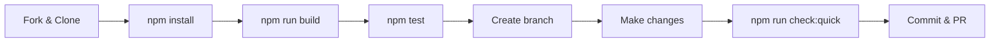
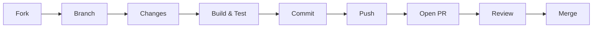

# Contributing to HakanMCP

> Thank you for your interest in contributing!
> For setup, see [SETUP.md](SETUP.md). For security, see [SECURITY.md](SECURITY.md).

## Table of Contents

- [Prerequisites](#prerequisites)
- [Development Setup](#development-setup)
- [Project Architecture](#project-architecture)
- [Making Changes](#making-changes)
- [Code Style](#code-style)
- [Commit Convention](#commit-convention)
- [Pull Request Flow](#pull-request-flow)
- [Testing](#testing)
- [Release Process](#release-process)
- [Code of Conduct](#code-of-conduct)

---

## Prerequisites

| Tool | Version | Check Command | Purpose |
|------|---------|---------------|---------|
| Node.js | >= 20 | `node --version` | Runtime |
| npm | >= 10 | `npm --version` | Package management |
| Git | >= 2.x | `git --version` | Version control |
| TypeScript | >= 5.x | `npx tsc --version` | Build (devDependency) |

---

## Development Setup



1. **Fork** the repository on GitHub
2. **Clone your fork:**
   ```bash
   git clone https://github.com/your-username/HakanMCP.git
   cd HakanMCP
   ```
3. **Install dependencies:**
   ```bash
   npm install
   ```
4. **Build the project:**
   ```bash
   npm run build
   ```
5. **Run tests:**
   ```bash
   npm test
   ```
6. **Create a feature branch** from `main`:
   ```bash
   git checkout -b feat/your-feature-name
   ```

---

## Project Architecture

<details>
<summary><strong>Where to put what</strong></summary>

| You want to... | Edit in... |
|-----------------|-----------|
| Add a new MCP tool | `src/tools/yourTool.ts` + register in `toolRegistry.ts` |
| Add a service | `src/services/yourService.ts` |
| Add a CLI command | `src/cli/yourCommand.ts` |
| Add types/interfaces | `src/types/` |
| Add utilities | `src/utils/` |
| Add tests | `tests/` (mirror source structure) |
| Add documentation | Root `.md` files (README, SETUP, etc.) |

</details>

---

## Making Changes

### Adding a New Tool

1. Create `src/tools/yourTool.ts`
2. Define tool with Zod input schema
3. Register in `src/toolRegistry.ts` using lazy-loading pattern
4. Add tests in `tests/`
5. Update tool count in README if needed

<details>
<summary><strong>Tool template</strong></summary>

```typescript
import { z } from 'zod';

const inputSchema = z.object({
  param: z.string().describe('Description'),
});

export async function yourTool(input: z.infer<typeof inputSchema>) {
  // Implementation
  return { success: true, data: result };
}
```

</details>

### Adding a Service

- Create in `src/services/`
- Use dependency injection pattern
- Keep files under 500 lines

### Adding a CLI Command

- Create in `src/cli/`
- Use Commander.js patterns from existing commands

---

## Code Style

| Rule | Guideline |
|------|-----------|
| Language | TypeScript (strict mode) |
| Modules | ESM (`"type": "module"` in package.json) |
| Validation | Zod schemas for all inputs |
| File size | < 500 lines per file |
| Imports | ESM (`import/export`) |
| Dependencies | Lazy-load optional deps |
| Formatting | Prettier + ESLint |
| Interfaces | Prefer typed interfaces for all public APIs |

- Follow existing patterns in the codebase
- Keep files under **500 lines** -- split into modules if needed
- Use **typed interfaces** for all public APIs
- Use **Zod schemas** for input validation at boundaries
- Prefer **lazy loading** for optional/heavy dependencies

<details>
<summary><strong>Formatting commands</strong></summary>

```bash
npm run lint          # Check for issues
npm run lint:fix      # Auto-fix issues
npm run format        # Fix formatting with Prettier
npx prettier --check . # Check formatting
npx prettier --write . # Fix formatting
```

</details>

---

## Commit Convention

Use [Conventional Commits](https://www.conventionalcommits.org/) format:

| Prefix | Usage |
|--------|-------|
| `feat:` | New feature or tool |
| `fix:` | Bug fix |
| `docs:` | Documentation only |
| `refactor:` | Code restructure, no behavior change |
| `test:` | Test additions |
| `chore:` | Build, CI, maintenance tasks |

**Examples:**
```
feat: add reactive mode event bus
fix: resolve watch mode crash on symlinks
docs: update CLI command reference
```

---

## Pull Request Flow



1. **Describe your changes** clearly in the PR description
2. **Reference related issues** (e.g., "Closes #42")
3. **Ensure the build passes** (`npm run build`)
4. **Keep PRs focused** -- one feature or fix per PR
5. **Be responsive** to review feedback

### PR Title Format

Use the same conventional commit prefixes:
```
feat: add scheduled mode cron expressions
fix: resolve Windows path handling in watch mode
```

### PR Checklist

- [ ] Feature branch from `main`
- [ ] Conventional commit messages
- [ ] `npm run check:quick` passes
- [ ] New tools have Zod input schemas
- [ ] Files under 500 lines
- [ ] No credentials or secrets in code

---

## Testing

```bash
npm test              # Run full test suite
npm run test:smoke    # Run smoke tests
npm run check:quick   # Build + smoke tests (fast)
```

### Test Structure

- **Smoke tests:** `tests/smoke/` -- basic startup and config validation
- **Unit tests:** `tests/` -- individual tool and service tests
- **Integration:** Manual testing with MCP client

### Writing Tests

```typescript
describe('yourTool', () => {
  it('should handle valid input', async () => {
    const result = await yourTool({ param: 'value' });
    expect(result.success).toBe(true);
  });

  it('should reject invalid input', async () => {
    await expect(yourTool({ param: '' })).rejects.toThrow();
  });
});
```

---

## Release Process

> **Maintainers only**

1. Update `VERSION` file
2. Update version in `package.json`
3. Add entry to `CHANGELOG.md` (Keep a Changelog format)
4. Commit: `release: vX.Y.Z`
5. Create and push tag: `git tag -a vX.Y.Z -m "vX.Y.Z" && git push origin vX.Y.Z`

---

## Code of Conduct

We are committed to providing a welcoming and inclusive environment. All contributors are expected to:

- Be respectful and constructive in discussions
- Welcome newcomers and help them get started
- Focus on the technical merits of contributions
- Accept constructive criticism gracefully

Harassment, discrimination, or disrespectful behavior will not be tolerated.

---

> **Questions?** Open an [issue](https://github.com/sudohakan/HakanMCP/issues) or start a [discussion](https://github.com/sudohakan/HakanMCP/discussions).
>
> We appreciate every contribution, whether it's a bug report, documentation improvement, or new feature!
