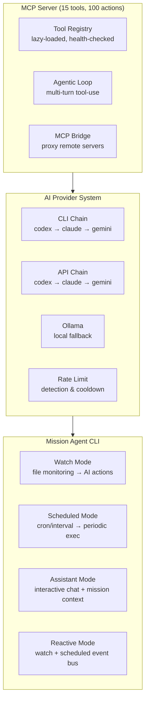

<div align="center">


# HakanMCP

**Unified AI Agent Orchestration & MCP Tool Platform**

15 MCP tools (100 actions) · 13 on-demand servers · 4 AI providers · 4 operating modes

[](CHANGELOG.md)
[](LICENSE)
[](https://nodejs.org)
[](https://www.typescriptlang.org)
[](#quick-start)
[](https://github.com/sudohakan/HakanMCP/actions)

[Quick Start](#-quick-start) · [Features](#-features) · [Architecture](#-architecture) · [CLI Reference](#-cli-commands) · [Contributing](#-contributing)

</div>

---

## Why HakanMCP?

> Most MCP servers give you a handful of tools. HakanMCP gives you **15 tools with 100 actions** — databases, AI providers, security, monitoring, workflows, and browser wrappers — all lazy-loaded and ready to use with Claude Code, Cursor, or any MCP client.

| What you get | Details |
|:---|:---|
| **15 MCP tools (100 actions)** | Databases, git, web, file ops, AI, security, monitoring, encryption, workflows, browser wrappers |
| **Multi-provider AI** | Automatic fallback: Codex → Claude → Gemini → Ollama |
| **Mission Agent CLI** | Autonomous task execution from markdown mission files |
| **4 operating modes** | Watch, Scheduled, Assistant, Reactive |
| **Agentic mode** | Multi-turn tool-use loops with automatic provider selection |
| **Lazy dependencies** | Only installs what you actually use — no bloat |
| **Rate limit handling** | Automatic cooldown management across all providers |
| **13 on-demand MCP servers** | Connect additional servers from the built-in catalog at runtime |
| **Low-token browser bridge** | Use Playwright through HakanMCP wrappers instead of returning large raw snapshots |

---

## 🚀 Quick Start

<details open>
<summary><strong>As MCP Server (Claude Code / Cursor)</strong></summary>

```bash
# One-liner via Claude Code CLI
claude mcp add hakanmcp node /path/to/HakanMCP/dist/src/index.js
```

Or add to your `claude_desktop_config.json`:

```json
{
  "mcpServers": {
    "hakanmcp": {
      "command": "node",
      "args": ["/path/to/HakanMCP/dist/src/index.js"]
    }
  }
}
```

</details>

<details>
<summary><strong>From Source</strong></summary>

```bash
git clone https://github.com/sudohakan/HakanMCP.git
cd HakanMCP
npm install
cp .env.example .env    # Add your API keys
npm run build           # Compile TypeScript → dist/
```

</details>

<details>
<summary><strong>As Mission Agent CLI</strong></summary>

```bash
npm install -g hakanmcp

# Interactive setup — config, workspace, mission via Q&A
hakanmcp init

# Start the mission agent
hakanmcp start                          # default workspace
hakanmcp start --workspace my-project   # specific workspace
hakanmcp start --all                    # all workspaces

# Dashboard
hakanmcp mission

# View reports
hakanmcp report
```

</details>

<details>
<summary><strong>As npm package</strong></summary>

```bash
npm install hakanmcp
```

```typescript
import { startServer } from 'hakanmcp';
```

</details>

> **Requires Node.js >= 20.0.0** · See [SETUP.md](SETUP.md) for detailed installation

---

## 🛠 Features

<table>
<tr>
<td width="50%" valign="top">

### 🤖 AI & Language Models
- Multi-provider chat with conversation history
- Content generation via configurable providers
- Direct provider-level chat (Claude, OpenAI, Gemini)
- AI safety, content filtering, threat detection
- Multi-turn agentic tool-use loops
- Multi-model consensus reaching
- Mixture of Experts routing
- Knowledge graph with semantic search
- Periodic self-reflection & emotional state

</td>
<td width="50%" valign="top">

### 🗄 Database Management
- **PostgreSQL** — Query, schema, pool stats
- **MySQL** — Query execution, schema management
- **MSSQL** — Query, schema, connection management
- **SQLite** — Lightweight local operations
- **MongoDB** — Full CRUD, aggregate, indexing
- Connection pooling with health checks
- Backup and restore operations

> Install only what you need: `npm install pg mysql2 mongodb`

</td>
</tr>
<tr>
<td width="50%" valign="top">

### ⚙️ DevOps & System
- OS, CPU, memory, disk information
- Process management (list, kill, monitor)
- System optimization suite (8-step pipeline)
- Health checks with auto-healing
- Performance benchmarking
- Cron/interval task scheduling
- Automated backup with retention policies
- Daily tool health verification

</td>
<td width="50%" valign="top">

### 🔒 Security & Encryption
- AES-256 file and value encryption
- Content safety filtering
- Security policy enforcement & auditing
- Guidance engine with compile/enforce/audit
- Environment variable management
- .env file protection

</td>
</tr>
<tr>
<td width="50%" valign="top">

### 🔄 Workflow & Automation
- Pipeline engine (define, validate, run, replay)
- Multi-agent swarm orchestration
- Self-improvement engine
- Postman collection management
- HTTP requests & file downloads
- Rate limiting & webhook handling
- Remote MCP server proxy (MCP Bridge)

</td>
<td width="50%" valign="top">

### 📂 File & Data Processing
- CSV, JSON, XML, YAML parsing
- Handlebars template engine
- File operations (CRUD, search, directory)
- Cache with TTL-based expiration
- GitBook documentation integration
- Git operations & GitHub integration

</td>
</tr>
</table>

### Browser Automation Through HakanMCP

When you need browser automation but want smaller, task-focused outputs, use the HakanMCP browser bridge instead of calling Playwright tools directly.

The `browser` tool provides all browser automation via the `action` parameter:
- `connect` — start or reuse a Playwright MCP connection
- `navigateExtract` — navigate and return a compact page summary
- `probeLogin` — detect login flows with focused indicators
- `captureProof` — capture a screenshot artifact plus a short summary
- `disconnect` — close one or all cached browser sessions

Example:

```json
{
  "tool": "browser",
  "arguments": {
    "action": "navigateExtract",
    "url": "https://example.com/login",
    "cdpEndpoint": "http://127.0.0.1:9222",
    "screenshotPath": "login-proof.png"
  }
}
```

This pattern is especially useful for Claude Code and other agent clients where raw browser snapshots can consume excessive context.

---

## 🏗 Architecture



<details>
<summary><strong>📁 Project Structure</strong></summary>

```
HakanMCP/
├── src/                    # TypeScript source
│   ├── index.ts            # MCP server entry point
│   ├── config.ts           # Zod-validated config loader
│   ├── toolRegistry.ts     # Lazy-loaded tool discovery
│   ├── tools/              # 14 tool modules (15 tools, 100 actions)
│   ├── services/           # Core services (agentic, backup, cache, consensus...)
│   ├── cli/                # CLI command handlers
│   ├── mission/            # Mission system (loader, runner, state)
│   ├── flows/              # Workflow pipeline engine
│   ├── reactive/           # Event bus & cross-mode routing
│   ├── scheduled/          # Cron/interval executor
│   └── watch/              # File watcher & triggers
├── bin/hakanmcp.ts         # CLI entry point
├── agents/                 # Agent YAML definitions
├── tests/                  # Jest test suite
├── .github/workflows/      # CI/CD (7 workflows)
└── docs/                   # Documentation
```

</details>

<details>
<summary><strong>🔄 Operating Modes</strong></summary>

| Mode | Command | Description |
|:---|:---|:---|
| **Watch** | `hakanmcp watch` | File system monitoring → AI-driven actions |
| **Scheduled** | `hakanmcp scheduled` | Cron/interval tasks with overlap guard |
| **Assistant** | `npm run console:chat` | Interactive chat with mission context |
| **Reactive** | `hakanmcp reactive` | Watch + Scheduled in unified event bus |

</details>

<details>
<summary><strong>🤖 AI Provider Fallback Chain</strong></summary>

```
Request → CLI Chain (codex → claude → gemini)
              ↓ all CLIs failed
          API Chain (codex → claude → gemini)
              ↓ all APIs failed
          Local Fallback (Ollama)
```

Configure priority in `config.yaml`:

```yaml
aiProviders:
  cliPriority: [codex, claude, gemini]
  apiPriority: [codex, claude, gemini]
  fallbackOrder: [cli, api, ollama]
  agenticEnabled: true
  agenticMaxIterations: 10
```

Rate limit detection supports: relative (`try again in 20s`), absolute (`resets at 4:16 PM`), and duration (`reset after 4h58m`) formats.

</details>

<details>
<summary><strong>📋 Mission System</strong></summary>

Missions are markdown files that define autonomous agent tasks:

```markdown
---
title: "crash-analyzer mission"
priority: primary
version: 1
schedule:
  mode: watch
tags: ["monitoring", "windows", "crash"]
---

Analyze Windows crash dump files and identify root causes.

# Tasks

- [ ] Scan target directory for .dmp files
- [ ] Parse dump headers and extract crash metadata
- [ ] Identify faulting module and error code
- [ ] Generate analysis report
```

Create via interactive Q&A: `hakanmcp init`

Each workspace gets isolated state in `.hakanmcp/workspaces/<name>/`.

</details>

---

## 💻 CLI Commands

| Command | Description |
|:---|:---|
| `hakanmcp init` | Interactive workspace setup (config + mission via Q&A) |
| `hakanmcp init --remove <name>` | Remove a workspace |
| `hakanmcp start [--workspace <name>] [--all]` | Start mission agent |
| `hakanmcp stop` | Stop running agent |
| `hakanmcp mission [--workspace <name>] [--all]` | Workspace dashboard |
| `hakanmcp report [-n 5]` | View reports |
| `hakanmcp watch` | File watcher mode |
| `hakanmcp scheduled` | Scheduled task mode |
| `hakanmcp reactive` | Reactive mode (watch + scheduled) |
| `hakanmcp doctor [fix]` | Health check / AI-driven auto-repair |

---

## ⚙️ Configuration

<details>
<summary><strong>Workspace Config (hakanmcp.config.yaml)</strong></summary>

```yaml
version: "1"

mission:
  primary: PRIMARY_MISSION.md

agent:
  provider: claude
  maxIterationsPerStep: 10
  stepTimeoutMs: 120000
  continueOnFailure: false

workspaces:
  - name: my-project
    path: /path/to/target
    primary: missions/my-project/PRIMARY_MISSION.md
    secondary: missions/my-project/SECONDARY_MISSION.md
```

</details>

<details>
<summary><strong>Environment Variables (.env)</strong></summary>

```bash
# AI API Keys (at least one recommended)
CODEX_API_KEY=sk-...
CLAUDE_CODE_API_KEY=sk-ant-...
GEMINI_API_KEY=AI...

# GitHub (for git integration tools)
GITHUB_TOKEN=ghp_...

# GitBook (optional)
GITBOOK_URL=https://your-instance.gitbook.io/your-api
```

See `.env.example` for the full list.

</details>

<details>
<summary><strong>Server Config (config.yaml)</strong></summary>

```yaml
server:
  name: hakanmcp
  logLevel: info

cache:
  defaultTTL: 300
  maxEntries: 1000

aiProviders:
  cliPriority: [codex, claude, gemini, cursor]
  apiPriority: [codex, claude, gemini]
  fallbackOrder: [cli, api, ollama]
  agenticEnabled: true

backup:
  maxBackups: 10
  compression: true
```

</details>

---

## 📊 At a Glance

| Metric | Value |
|:---|:---|
| Total MCP tools | 15 (100 actions) |
| On-demand MCP servers | 13 |
| Tool modules | 14 |
| AI providers supported | 4 (Codex, Claude, Gemini, Ollama) |
| Database engines | 5 (PostgreSQL, MySQL, MSSQL, SQLite, MongoDB) |
| Operating modes | 4 (Watch, Scheduled, Assistant, Reactive) |
| CI/CD workflows | 7 |
| Test suite | 247 tests |
| License | MIT |

---

## 📖 Documentation

| Document | Description |
|:---|:---|
| **[SETUP.md](SETUP.md)** | Installation, platform-specific setup, IDE integration |
| **[CONTRIBUTING.md](CONTRIBUTING.md)** | Development workflow, code style, PR guidelines |
| **[SECURITY.md](SECURITY.md)** | Vulnerability reporting and security policy |
| **[CHANGELOG.md](CHANGELOG.md)** | Version history and release notes |

---

## 🤝 Contributing

Contributions welcome! See [CONTRIBUTING.md](CONTRIBUTING.md) for guidelines.

```bash
git clone https://github.com/sudohakan/HakanMCP.git
cd HakanMCP
npm install
npm run build
npm test
```

---

## 📄 License

[MIT](LICENSE) — free for personal and commercial use.

<div align="center">

Built with TypeScript · Powered by [Model Context Protocol](https://modelcontextprotocol.io)

</div>
