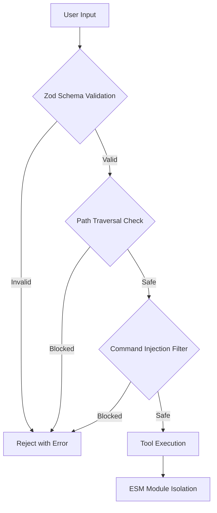

# Security Policy

> For setup instructions, see [SETUP.md](SETUP.md). For contributing, see [CONTRIBUTING.md](CONTRIBUTING.md).

## Table of Contents

- [Supported Versions](#supported-versions)
- [Reporting a Vulnerability](#reporting-a-vulnerability)
- [Response Timeline](#response-timeline)
- [Security Architecture](#security-architecture)
- [Best Practices](#best-practices)
- [Dependency Security](#dependency-security)

---

## Supported Versions

| Version | Supported          |
| ------- | ------------------ |
| 1.0.x   | :white_check_mark: |
| < 1.0   | :x:                |

---

## Reporting a Vulnerability

If you discover a security vulnerability in HakanMCP, please report it responsibly.

**Preferred:** [GitHub Security Advisory](https://github.com/sudohakan/HakanMCP/security/advisories/new) (private by default)

**Email:** security@hakanmcp.dev

### What to include in your report

- A clear description of the vulnerability
- Steps to reproduce the issue
- Impact assessment (what an attacker could achieve)
- Any suggested fixes or mitigations (optional)

### Disclosure policy

Please do **not** publicly disclose the vulnerability until a fix has been released. We will coordinate with you on a disclosure timeline and credit you in the release notes (unless you prefer to remain anonymous).

---

## Response Timeline

| Stage | Timeline | Description |
|-------|----------|-------------|
| Acknowledgment | 48 hours | We confirm receipt of your report |
| Assessment | 5 business days | We evaluate severity and impact |
| Fix (Critical) | 7 days | Patch developed and released |
| Fix (High) | 14 days | Patch in next minor release |
| Fix (Medium/Low) | Next release | Included in regular release cycle |
| Disclosure | After fix deployed | Coordinated disclosure with reporter |

---

## Security Architecture

HakanMCP implements defense-in-depth with multiple security layers:

<strong>Security measures in detail</strong>

### Input Validation (Zod)
All tool inputs are validated through Zod schemas before processing. Invalid inputs are rejected with descriptive error messages before reaching any business logic.

### Path Traversal Prevention
File operation tools validate paths to prevent directory traversal attacks (`../`). Paths are resolved and checked against allowed base directories.

### Command Injection Protection
System command tools sanitize inputs to prevent shell injection. Arguments are escaped and validated before execution.

### No Hardcoded Secrets
All sensitive values (API keys, database credentials, tokens) are loaded from environment variables via `.env` files. The `.env` file is excluded from version control.

### ESM Module Isolation
Tools run as ESM modules with their own scope, preventing cross-tool state pollution and reducing the blast radius of any potential exploit.

### Lazy-Loaded Dependencies
Optional dependencies (database drivers, heavy modules) are loaded only when needed, reducing the attack surface for unused features.

---

## Best Practices

When using HakanMCP, follow these security guidelines:

- [ ] Keep Node.js and all dependencies updated (`npm audit` regularly)
- [ ] Use environment variables for all secrets — never hardcode credentials
- [ ] Enable input validation on all custom tools (use Zod schemas)
- [ ] Review logs regularly for suspicious activity (`logs/` directory)
- [ ] Follow the principle of least privilege — only enable tools you need
- [ ] Run `npm audit` before deploying to check for known vulnerabilities
- [ ] Use `.env.example` as a template — never share your `.env` file

---

## Dependency Security

<strong>Dependency management practices</strong>

### Required Dependencies
Core dependencies (`@modelcontextprotocol/sdk`, `zod`, `commander`, `winston`) are pinned to specific versions in `package-lock.json` and reviewed before updates.

### Optional Dependencies
Database drivers (`pg`, `mongodb`, `mysql2`, `mssql`, `better-sqlite3`) are optional. If you don't use database tools, these are never loaded — reducing your attack surface.

### Audit Cadence
- Run `npm audit` before each release
- Critical vulnerabilities are patched within 7 days
- Non-critical vulnerabilities are addressed in the next regular release

### Update Process
1. `npm audit` — identify vulnerabilities
2. `npm update` — apply compatible updates
3. Test suite (`npm run check:quick`) — verify nothing breaks
4. Review changelogs of updated packages for breaking changes

---

> **Questions about security?** Contact us at the email listed in [Reporting a Vulnerability](#reporting-a-vulnerability).
