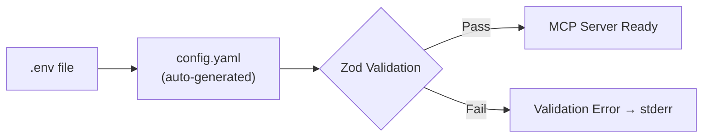

# Setup Guide

> Complete guide to get HakanMCP running locally.
> For quick overview, see [README](README.md). For contributing, see [CONTRIBUTING](CONTRIBUTING.md).

## Table of Contents

- [Requirements](#requirements)
- [Installation](#installation)
- [Configuration](#configuration)
- [Verification](#verification)
- [IDE Integration](#ide-integration)
- [Troubleshooting](#troubleshooting)

---

## Requirements

| Tool | Version | Required | Purpose |
|------|---------|----------|---------|
| Node.js | >= 20 | Yes | Runtime engine |
| npm | >= 10 | Yes | Package management |
| Git | >= 2.x | Yes | Version control |
| TypeScript | >= 5.x | Auto | Build toolchain (devDependency) |
| PostgreSQL | >= 14 | Optional | SQL database tools |
| MongoDB | >= 6.0 | Optional | NoSQL database tools |
| Python | >= 3.8 | Optional | AI defence, scripting tools |

<details>
<summary><strong>Why are some dependencies optional?</strong></summary>

HakanMCP uses **lazy-loading** for database drivers and heavy modules. If you don't need SQL or MongoDB tools, skip those installs — the server runs fine without them.

**Tools affected by missing optional dependencies:**

| Missing Dependency | Affected Tools |
|-------------------|----------------|
| `pg` (PostgreSQL) | `db_query`, `db_backup`, `db_getTableSchema`, `db_listTables` |
| `mongodb` | `mongo_find`, `mongo_insert`, `mongo_update`, `mongo_delete`, `mongo_aggregate` |
| `mysql2` | MySQL variant of `db_query`, `db_backup` |
| `mssql` | MSSQL variant of `db_query`, `db_backup` |
| `sqlite` / `sqlite3` | SQLite variant of `db_query` |
| Python 3.8+ | `aidefence` tools (input scan, PII check, redaction) |

All other tools work without any optional dependencies.

</details>

---

## Installation

### 1. Clone the Repository

<details>
<summary><strong>Windows (PowerShell)</strong></summary>

```powershell
git clone https://github.com/sudohakan/HakanMCP.git
cd HakanMCP
npm install
```

</details>

<details>
<summary><strong>macOS / Linux</strong></summary>

```bash
git clone https://github.com/sudohakan/HakanMCP.git
cd HakanMCP
npm install
```

</details>

> **Note:** If you need database tools, install optional dependencies explicitly:
> ```bash
> npm install pg mongodb mysql2 mssql sqlite sqlite3
> ```

### 2. Environment Setup

```bash
cp .env.example .env
```

> **Warning:** Never commit `.env` to git. It contains API keys and database credentials.

Open `.env` and fill in the values you need. See [Configuration](#configuration) for a full variable reference.

### 3. Build & Start

```bash
npm run build    # Compile TypeScript + generate tool manifest
npm start        # Start MCP server
```

For development with auto-reload:

```bash
npm run dev
```

> **Tip:** You only need one AI provider key to get started. Claude (`CLAUDE_CODE_API_KEY`) or OpenAI (`CODEX_API_KEY`) are recommended for the best experience. Additional providers add fallback redundancy.

---

## Configuration



HakanMCP reads `.env` on startup, generates `config.yaml`, and validates all values through Zod schemas. Invalid configuration is caught before the server starts.

<details>
<summary><strong>Complete .env variable reference</strong></summary>

#### GitHub

| Variable | Default | Required | Description |
|----------|---------|----------|-------------|
| `GITHUB_TOKEN` | — | Conditional | GitHub personal access token. Required if `config.github.enabled: true`. Scopes: `repo`, `public_repo`. Generate at https://github.com/settings/tokens |

#### AI API Keys

| Variable | Default | Required | Description |
|----------|---------|----------|-------------|
| `CODEX_API_KEY` | — | Optional | OpenAI / Codex API key for chat and code generation tools |
| `OPENAI_API_KEY` | — | Optional | Alternative variable name for `CODEX_API_KEY` |
| `CLAUDE_CODE_API_KEY` | — | Optional | Anthropic / Claude API key for Claude-based AI tools |
| `ANTHROPIC_API_KEY` | — | Optional | Alternative variable name for `CLAUDE_CODE_API_KEY` |
| `GEMINI_API_KEY` | — | Optional | Google Gemini API key for Gemini-based AI tools |

> At least one AI API key is recommended for chat and consciousness features.

#### Encryption

| Variable | Default | Required | Description |
|----------|---------|----------|-------------|
| `AI_KEY_PASSWORD` | — | Optional | Password for decrypting encrypted AI keys stored in `config.aiProviders.*KeyEncrypted` |

#### AI Base URL Overrides

| Variable | Default | Required | Description |
|----------|---------|----------|-------------|
| `CLAUDE_BASE_URL` | `https://api.anthropic.com/v1/messages` | Optional | Override Anthropic API endpoint (useful for proxies or self-hosted instances) |
| `CODEX_BASE_URL` | `https://api.openai.com/v1/chat/completions` | Optional | Override OpenAI API endpoint |
| `GEMINI_BASE_URL` | `https://generativelanguage.googleapis.com/v1beta/models` | Optional | Override Google Gemini API endpoint |

#### Logging & Cache

| Variable | Default | Required | Description |
|----------|---------|----------|-------------|
| `LOG_LEVEL` | `info` | Optional | Winston log level (`error`, `warn`, `info`, `debug`, `verbose`) |
| `HAKANMCP_LOG_LEVEL` | `info` | Optional | Prefixed alternative to `LOG_LEVEL` (takes precedence) |
| `CACHE_TTL` | `300` | Optional | Default cache time-to-live in seconds |
| `HAKANMCP_CACHE_TTL` | `300` | Optional | Prefixed alternative to `CACHE_TTL` (takes precedence) |

#### External Services

| Variable | Default | Required | Description |
|----------|---------|----------|-------------|
| `GITBOOK_URL` | — | Optional | GitBook instance URL for `gb_*` tools (e.g. `https://your-instance.gitbook.io/your-api`) |
| `MONITORING_PEER_INSTANCE` | — | Optional | Peer instance URL for monitoring sync (usually `/peer` in Docker setups) |

#### Scheduler & Automation

| Variable | Default | Required | Description |
|----------|---------|----------|-------------|
| `SCHEDULER_ENABLED` | `true` | Optional | Enable or disable the built-in task scheduler |
| `SELF_IMPROVEMENT_ENABLED` | `true` | Optional | Enable self-improvement agent capabilities |
| `AUTONOMY_ENABLED` | `true` | Optional | Enable autonomous task execution |
| `AUTONOMY_INTERVAL_SECONDS` | `600` | Optional | Interval (in seconds) between autonomous task runs |
| `AUTONOMY_RUN_MAIN_GOAL` | `true` | Optional | Execute main goal during autonomous runs |
| `AUTONOMY_RUN_SECOND_GOAL` | `true` | Optional | Execute secondary goal during autonomous runs |

#### Paths

| Variable | Default | Required | Description |
|----------|---------|----------|-------------|
| `HAKANMCP_PROJECT_ROOT` | Auto-detected | Optional | Override the detected project root directory |
| `FLOW_HISTORY_PATH` | `logs/flows/history.jsonl` | Optional | File path for flow execution history |
| `FLOW_CONNECTIONS_PATH` | `logs/flows/connections.json` | Optional | File path for flow connections data |
| `FLOW_VERSION_DIR` | — | Optional | Directory for flow version storage |
| `KNOWLEDGE_GRAPH_DIR` | `data/` | Optional | Directory for knowledge graph data |

#### Development

| Variable | Default | Required | Description |
|----------|---------|----------|-------------|
| `AUTO_RELOAD` | `true` | Optional | Enable auto-reload on file changes during development |
| `CHOKIDAR_USEPOLLING` | `true` | Optional | Use polling for file watching (useful in Docker or WSL environments) |

</details>

---

## Verification

Run the quick check suite:

```bash
npm run check:quick
```

Expected output:
```
✓ Config loaded successfully
✓ Tool registry initialized (131 tools)
✓ Smoke tests passed
```

### Manual Verification Checklist

- [ ] `npm run check:quick` passes without errors
- [ ] `npm start` — server starts, logs show "MCP server listening"
- [ ] `hakanmcp --version` — shows current version
- [ ] `hakanmcp tools` — lists all registered tools
- [ ] `hakanmcp doctor` — health checks pass (version, build, config)
- [ ] MCP client connects successfully (see [IDE Integration](#ide-integration))

---

## IDE Integration

<details>
<summary><strong>Claude Code (recommended)</strong></summary>

Add to your `~/.claude.json`:

```json
{
  "mcpServers": {
    "hakanmcp": {
      "command": "node",
      "args": ["C:/path/to/HakanMCP/dist/src/index.js"],
      "env": {}
    }
  }
}
```

Replace the path with your actual HakanMCP installation directory.

Verify: Run `claude` and check that HakanMCP tools appear in available tools.

</details>

<details>
<summary><strong>VS Code + Continue</strong></summary>

Add to your Continue configuration (`.continue/config.json`):

```json
{
  "mcpServers": [
    {
      "name": "hakanmcp",
      "command": "node",
      "args": ["C:/path/to/HakanMCP/dist/src/index.js"]
    }
  ]
}
```

</details>

<details>
<summary><strong>Cursor</strong></summary>

In Cursor settings, add MCP server:

- **Name:** hakanmcp
- **Command:** `node`
- **Args:** `C:/path/to/HakanMCP/dist/src/index.js`

</details>

---

## Troubleshooting

| Symptom | Cause | Solution |
|---------|-------|----------|
| `sqlite3` build fails | Missing C++ build tools | Install Visual Studio Build Tools (Windows) or `build-essential` (Linux), or skip: `npm install --ignore-optional` |
| `ECONNREFUSED` on db_query | Database service not running | Start PostgreSQL/MongoDB/MySQL service |
| `EADDRINUSE` — port already in use | Another process using the port | Change `PORT` in `.env` or kill the blocking process |
| `MODULE_NOT_FOUND: pg` | Optional dependency not installed | `npm install pg` (or the specific driver you need) |
| Config validation error | Invalid values in `.env` | Compare your `.env` against `.env.example` — check types and formats |
| Permission denied (Linux/macOS) | npm global install issues | Use `nvm` to manage Node.js, avoid `sudo npm` |
| TypeScript build errors | Stale build cache | `rm -rf dist/ && npm run build` |
| MCP connection timeout | Firewall or wrong port | Check firewall rules, verify PORT matches client config |
| `hakanmcp` command not found | CLI not linked | Run `npm link` in project root, or use `npx hakanmcp` |
| Zod validation: unexpected field | config.yaml from older version | Delete `config.yaml` and restart — it auto-regenerates |

<details>
<summary><strong>Still stuck?</strong></summary>

1. **Check logs:** Look in the `logs/` directory for Winston daily-rotate logs
2. **Debug mode:** Set `LOG_LEVEL=debug` in `.env` for verbose output
3. **Doctor check:** Run `hakanmcp doctor` for automated health diagnostics
4. **Doctor fix:** Run `hakanmcp doctor fix` for AI-driven auto-repair
5. **Open an issue:** Include the doctor output and your Node.js version (`node --version`)

</details>

---

> **Next steps:** See [README](README.md) for features overview, or [CONTRIBUTING](CONTRIBUTING.md) to start developing.
